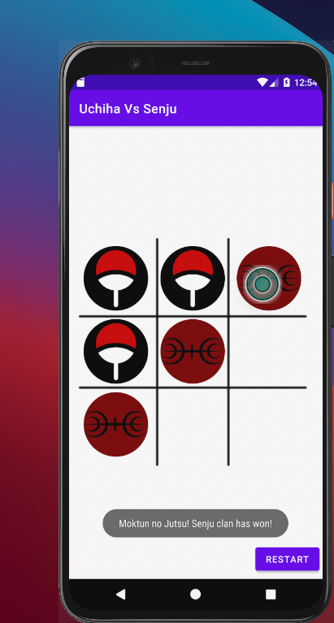
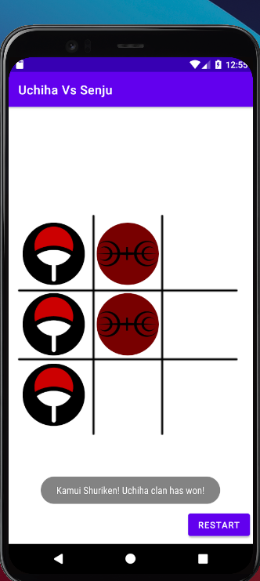
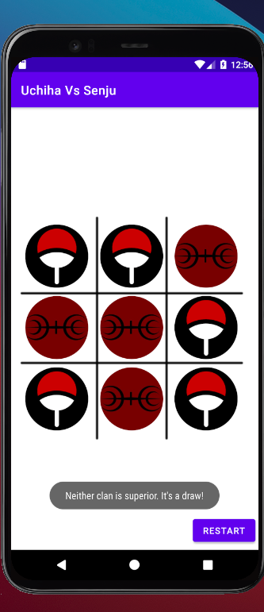

#Uchiha VS Senju Tick Tack Toe Game For Android

## Introduction

I'm an anime fan, and to that fact, I decided to create a tick-tack toe java game app that simulates my biggest. curiosities : 💡💡💡💡
That's when it hit me. The Uchiha VS Senju.

Hope you enjoy it!
Min SDK Is Lollipop so almost every smartphone should support it .😏
Critique is welcome. This is my Java noob phase so let me act cool for once 😎   😎   😎   😎.

## Installation

Prereq : Android studio installed.
1. Double click on the build.gradle file and open it with android studio.
2. Click on the build or play button ▶️  to build the project.

PS ☝️: By default it will build to the android simulator installed. If you want to install it on your device, plug it into your pc, enable developer options , and have fun!

😱 if you don't have an emulator device setup already, quick start would be to search for avd manager from android studio, and create a virtual device from there
Here's a link if you get lost 🔎 [A stackoverflow I'm here to help you find answer](https://stackoverflow.com/questions/46948322/how-to-open-avd-manager-in-android-studio-3-0-version) 🕵️‍♂️

## Look & Feel.
Basic - Sorry. Not in the mood for intensive ui design.

